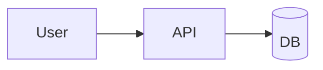

# Obsidian 노트

일관된 메타데이터를 담고, vault에 깔끔히 안착하며, 그래프에 기여하는
Obsidian Flavored Markdown (OFM) 노트를 생성한다. 목표는 단독으로 존재
하는 노트가 아니라 — 지식 시스템에서 쿼리/링크 가능한 노드가 되는 것이다.

사용자가 어떤 종류의 노트를 요청하든, 일치하는 템플릿을 선택하고
아래의 공통 컨벤션을 따라 사용자가 vault에 붙여넣거나 저장할 수 있는
OFM을 발행한다.

## 템플릿 카탈로그

### 개발 / 기술

| When | Template | Why this shape |
|------|----------|----------------|
| 버전 릴리즈 요약 | [release-note](assets/release-note.md) | 타입별 변경 그룹화, PR/이슈 링크, 업그레이드 가이드 |
| 아키텍처/기술 결정 | [adr](assets/adr.md) | 미래의 자신을 위한 Status + context + decision + consequences |
| 스프린트/이터레이션 마무리 | [retro](assets/retro.md) | Start/Stop/Continue + 후속 액션 아이템 링크 |
| 라이브 디버깅 세션 | [debug-log](assets/debug-log.md) | 증상 → 가설 → 증거 타임라인 |
| 라이브러리/도구 학습 | [learning-note](assets/learning-note.md) | 요약 + 핵심 API + 함정 + 다이어그램 옵션 |

### 시간 기반 / 계획

| When | Template | Why this shape |
|------|----------|----------------|
| 데일리 로그 / 개발 저널 | [daily-note](assets/daily-note.md) | 오늘 / 한 일 / 배운 것 / 내일; 관련 노트 링크 |
| 주간 리뷰 | [weekly-review](assets/weekly-review.md) | 출시 / 학습 / 메트릭 / 다음 주 목표 |
| 미팅 캡처 | [meeting-note](assets/meeting-note.md) | 참석자 + 안건 + 결정 + 담당자 있는 액션 아이템 |

### 지식 & 발견

| When | Template | Why this shape |
|------|----------|----------------|
| 프로젝트 개요 / Map of Content | [project-moc](assets/project-moc.md) | 관련 노트의 큐레이팅된 인덱스; 주제로 가는 "정문" |
| 책/기사 캡처 | [book-note](assets/book-note.md) | 서지 정보 + 요약 + 하이라이트 + 내 견해; atomic-note-ready |
| 빠른 아이디어 / 생각 | [fleeting-idea](assets/fleeting-idea.md) | 검토 날짜와 함께 저마찰 캡처; 추후 learning/ADR로 업그레이드 |

정확한 레이아웃은 템플릿 파일을 읽어 가져온다 — 메모리에서
재구성하려 들지 말 것. frontmatter 블록은 그대로 복사한다 (dataview
쿼리에 맞춰 튜닝됨) 그리고 본문 섹션을 채운다.

## 공통 컨벤션

### Frontmatter (모든 노트)

모든 노트는 frontmatter로 시작한다. dataview 쿼리와 property panel
이 예측 가능하게 유지되도록 키 순서를 안정적으로 둔다.

```yaml
---
type: release | adr | retro | debug | learning | daily | weekly | meeting | moc | book | fleeting
status: <per-type, see conventions doc>
created: YYYY-MM-DD
tags: [type/<category>, project/<name>, topic/<area>]
project: <project name>
related: ["[[Other Note]]", "[[Yet Another]]"]
---
```

전체 스키마, 타입별 status 전이, 태그 분류는
[frontmatter-conventions.md](references/frontmatter-conventions.md)
참조.

### 제목 (H1)

`# ` (H1) 을 frontmatter 직후에 정확히 한 번 사용한다. 각 템플릿
이 기대 제목 형태를 인코딩한다. 일반 형태:

- Release: `# v1.9.4 Release Notes`
- ADR: `# ADR-0012: Scope find_git_root to hibi repo`
- Retro: `# Sprint 2026-W16 Retrospective`
- Debug: `# Debug — login infinite loop (2026-04-22)`
- Learn: `# Zustand v5 — useShallow and selector equality`
- Daily: `# 2026-04-22 Tuesday`
- Weekly: `# Week 2026-W17 Review`
- Meeting: `# 2026-04-22 Platform sync — cache invalidation plan`
- MOC: `# hibi_ai — Project Map`
- Book: `# A Philosophy of Software Design — John Ousterhout`
- Fleeting: `# Thought — possible caching layer at edge`

### vault 내부 참조에 wikilink 사용

Obsidian의 그래프는 `[[...]]` 링크를 사용한다. vault에 살거나 살 수
있는 모든 것에 wikilink를 사용한다. `[text](url)`은 외부 참조에
남겨둔다.

```markdown
- Fixes regression from [[ADR-0009 Sync bundled cache]]      <!-- vault -->
- See the release on [GitHub](https://github.com/org/repo)   <!-- external -->
```

블록 단위 정밀도를 위해 `[[Note#^anchor]]`를 사용한다.

### 구조적 강조에 callout 사용

평범한 blockquote 대신 callout (`> [!type]`) 을 구조적 강조에 사용한다.
전체 목록: [obsidian-syntax.md](references/obsidian-syntax.md).
가장 많이 사용되는 것:

```markdown
> [!warning] Breaking change
> [!info] Context
> [!question] Unknown
> [!success] Decided
> [!bug] Symptom
> [!tldr] One-liner
> [!todo] Outstanding
```

### 다이어그램과 시각화

Obsidian은 Mermaid를 네이티브로 렌더링하고 Excalidraw와
JSON Canvas와 잘 통합된다. 학습 노트, 시스템 설계, 아키텍처,
타임라인용:

````markdown

````

올바른 다이어그램 타입 선택, MathJax, PlantUML 폴백, Canvas/Excalidraw
로 가야 할 때에 대한 가이드: [diagrams.md](references/diagrams.md).

### 장식이 아닌 메타데이터로서의 태그

태그는 필터 키다. 모든 노트는 **최소한** 다음을 갖는다:

- `type/<category>` — 노트 종류 (`type/adr`, `type/daily`, …)
- `project/<name>` — 프로젝트 슬러그 (개인은 `project/none`)
- `topic/<area>` — 도메인 영역 (`topic/auth`, `topic/perf`, `topic/health`)

frontmatter 태그를 인라인에 중복하지 말 것; Obsidian이 합친다.

### 날짜

frontmatter와 헤딩에 ISO `YYYY-MM-DD`를 사용한다. 주간 노트는
`YYYY-Wnn` (ISO 주). 날짜는 사전순으로 정렬된다 — Obsidian의
Daily Notes 플러그인과 dataview가 이에 의존한다.

### Dataview 친화적 설계

frontmatter 스키마 + 태그 분류는 본문 파싱 없이 노트를 dataview
쿼리 가능하게 만든다. 일반 쿼리는
[dataview-recipes.md](references/dataview-recipes.md) 에 있다 — "회고
간 열린 액션 아이템," "프로젝트별 status로 ADR," "이번 주의
데일리 노트" 등. 사용자가 인덱스/개요 노트를 요청하면, 손으로
나열하는 대신 dataview 쿼리 임베드를 고려한다.

## 워크플로우

1. 사용자 의도에 맞는 **템플릿을 선택**한다.
2. 해당 `assets/<template>.md`를 **읽는다** — 재구성 금지.
3. frontmatter를 실제 값으로 **채운다** (placeholder 잔류 금지).
4. 템플릿의 섹션 순서대로 본문을 **작성**한다.
5. **링크화** — 다른 노트 언급을 `[[wikilinks]]`로 변환한다;
   외부 URL은 Markdown 링크로 둔다.
6. **시각화** — 다이어그램이 산문보다 명료한 곳에 Mermaid를 임베드한다;
   형태가 공간적 (board, mind-map) 인 곳은 인라인보다 Canvas/Excalidraw
   파일이 더 좋은 집임을 노트한다.
7. **태그 검토** — 세 개의 필수 태그 축이 있는지 확인한다.
8. 최종 Markdown을 **발행**한다. 사용자가 vault에 저장을 요청했으면,
   주어진 경로에 쓴다; 그렇지 않으면 텍스트를 반환한다.

## Vault 저장 (선택)

사용자가 vault 경로를 제공하거나 저장을 요청하면, 다음 파일명
컨벤션을 따른다 — Daily Notes / Periodic Notes 플러그인과 일반 폴더
레이아웃에 일치한다.

| Type | Path template |
|------|---------------|
| ADR | `ADR/ADR-NNNN-<slug>.md` |
| Release | `Release Notes/v<version>.md` |
| Retro | `Retros/YYYY-Wnn.md` |
| Debug | `Debug/YYYY-MM-DD <slug>.md` |
| Learning | `Library/<Name>/<Topic>.md` |
| Daily | `Daily/YYYY-MM-DD.md` |
| Weekly | `Weekly/YYYY-Wnn.md` |
| Meeting | `Meetings/YYYY-MM-DD <slug>.md` |
| MOC | `MOC/<Project or Topic>.md` 또는 `+ <Project>.md` (접두사 컨벤션) |
| Book | `Library/Books/<Author> — <Title>.md` |
| Fleeting | `Fleeting/YYYY-MM-DD-HHmm.md` |

명백할 때 기존 vault 구조를 보존한다 — 사용자가 폴더를 갖고 있으면,
그것을 사용한다. 평행 계층을 만들지 말 것.

PARA / Zettelkasten 적응, MOC 전략, "fleeting" 노트를 evergreen으로
접는 시점은 [vault-organization.md](references/vault-organization.md)
참조.

## 안티 패턴

- vault 내부 참조에 `[](path.md)`를 **사용하지 말 것** — 그래프가 깨진다.
- frontmatter와 본문 사이에 YAML 키를 **중복하지 말 것**.
- 태그 축을 **창작하지 말 것** (`#status`, `#year-2026`) — 구조화된
  메타데이터에는 frontmatter 필드를 사용한다; 태그는 주제 필터로 남겨둔다.
- wikilink에 절대 vault 경로를 **하드코딩하지 말 것** — `[[Note]]`
  는 폴더와 무관하게 해결된다.
- ADR/debug에 `status`를 **빠뜨리지 말 것** — 미래의 자신이
  superseded / resolved를 알 수 있게 하는 것이 핵심이다.
- 레이아웃에 인라인 HTML을 **사용하지 말 것** — Reading 모드 렌더링이 깨진다.
- 원시 브레인스토밍을 `learning` 노트에 **버리지 말 것** —
  `fleeting`을 먼저 사용하고, 추후 업그레이드한다. 학습 노트는 큐레이팅된 출력물이다.

## 참고 자료

- [frontmatter-conventions.md](references/frontmatter-conventions.md) — type × status 매트릭스, 태그 분류, 타입별 추가
- [obsidian-syntax.md](references/obsidian-syntax.md) — callout, wikilink, embed, block ref, Mermaid, MathJax
- [diagrams.md](references/diagrams.md) — Mermaid 다이어그램 선택 가이드, PlantUML/Excalidraw/Canvas 결정 트리
- [dataview-recipes.md](references/dataview-recipes.md) — 인덱스 / MOC 노트용 일반 쿼리
- [vault-organization.md](references/vault-organization.md) — 폴더 레이아웃, MOC 전략, fleeting → evergreen 업그레이드 경로
- [assets/](assets/) 의 템플릿.
