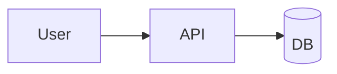

# Obsidian Notes

Produce Obsidian Flavored Markdown (OFM) notes that carry consistent
metadata, land cleanly in a vault, and contribute to the graph. The
goal is notes that don't just stand alone — they become queryable,
linkable nodes in a knowledge system.

When the user asks for a note of any kind, pick the matching template,
follow the common conventions below, and emit OFM the user can paste
or save into their vault.

## Template catalog

### Development / technical

| When | Template | Why this shape |
|------|----------|----------------|
| Version release summary | [release-note](assets/release-note.md) | Groups changes by type, links PRs/issues, upgrade guidance |
| Architectural / technical decision | [adr](assets/adr.md) | Status + context + decision + consequences for future-you |
| Sprint / iteration wrap-up | [retro](assets/retro.md) | Start/Stop/Continue + action items linking follow-ups |
| Live debugging session | [debug-log](assets/debug-log.md) | Symptom → hypothesis → evidence timeline |
| Library / tool learning | [learning-note](assets/learning-note.md) | Summary + key APIs + gotchas + diagram options |

### Time-based / planning

| When | Template | Why this shape |
|------|----------|----------------|
| Daily log / dev journal | [daily-note](assets/daily-note.md) | Today / did / learned / tomorrow; links to related notes |
| Weekly review | [weekly-review](assets/weekly-review.md) | Shipped / learned / metrics / next-week goals |
| Meeting capture | [meeting-note](assets/meeting-note.md) | Attendees + agenda + decisions + action items with owners |

### Knowledge & discovery

| When | Template | Why this shape |
|------|----------|----------------|
| Project overview / Map of Content | [project-moc](assets/project-moc.md) | Curated index of related notes; the "front door" to a topic |
| Book / article capture | [book-note](assets/book-note.md) | Bib info + summary + highlights + my-take; atomic-note-ready |
| Quick idea / thought | [fleeting-idea](assets/fleeting-idea.md) | Low-friction capture with review date; upgrades to learning/ADR later |

Read the template file to get the exact layout — don't try to
reconstruct from memory. Copy the frontmatter block verbatim (it's
tuned for dataview queries) and fill the body sections.

## Common conventions

### Frontmatter (every note)

Every note starts with frontmatter. Keep key order stable so dataview
queries and the property panel stay predictable.

```yaml
---
type: release | adr | retro | debug | learning | daily | weekly | meeting | moc | book | fleeting
status: <per-type, see conventions doc>
created: YYYY-MM-DD
tags: [type/<category>, project/<name>, topic/<area>]
project: <project name>
related: ["[[Other Note]]", "[[Yet Another]]"]
---
```

See [frontmatter-conventions.md](references/frontmatter-conventions.md)
for the full schema, status transitions per type, and the tag taxonomy.

### Title (H1)

Use `# ` (H1) exactly once, right after frontmatter. Each template
encodes the expected title shape. Typical forms:

- Release: `# v1.9.4 Release Notes`
- ADR: `# ADR-0012: Scope find_git_root to hibi repo`
- Retro: `# Sprint 2026-W16 Retrospective`
- Debug: `# Debug — login infinite loop (2026-04-22)`
- Learn: `# Zustand v5 — useShallow and selector equality`
- Daily: `# 2026-04-22 Tuesday`
- Weekly: `# Week 2026-W17 Review`
- Meeting: `# 2026-04-22 Platform sync — cache invalidation plan`
- MOC: `# hibi_ai — Project Map`
- Book: `# A Philosophy of Software Design — John Ousterhout`
- Fleeting: `# Thought — possible caching layer at edge`

### Wikilinks for vault-internal refs

Obsidian's graph uses `[[...]]` links. Use wikilinks for anything that
lives (or could live) in the vault. Reserve `[text](url)` for external
references.

```markdown
- Fixes regression from [[ADR-0009 Sync bundled cache]]      <!-- vault -->
- See the release on [GitHub](https://github.com/org/repo)   <!-- external -->
```

For block-level precision, use `[[Note#^anchor]]`.

### Callouts for structural emphasis

Use callouts (`> [!type]`) instead of plain blockquotes for structural
emphasis. Full list: [obsidian-syntax.md](references/obsidian-syntax.md).
Most used:

```markdown
> [!warning] Breaking change
> [!info] Context
> [!question] Unknown
> [!success] Decided
> [!bug] Symptom
> [!tldr] One-liner
> [!todo] Outstanding
```

### Diagrams and visualization

Obsidian renders Mermaid natively and integrates well with Excalidraw
and JSON Canvas. For learning notes, system design, architecture, and
timelines:

````markdown

````

Guide to picking the right diagram type, MathJax, PlantUML fallback,
and when to reach for Canvas/Excalidraw instead:
[diagrams.md](references/diagrams.md).

### Tags as metadata, not decoration

Tags are filter keys. Every note carries **at least**:

- `type/<category>` — kind of note (`type/adr`, `type/daily`, …)
- `project/<name>` — slug of the project (`project/none` for personal)
- `topic/<area>` — domain area (`topic/auth`, `topic/perf`, `topic/health`)

Avoid duplicating frontmatter tags inline; Obsidian merges them.

### Dates

Use ISO `YYYY-MM-DD` in frontmatter and headings. Weekly notes use
`YYYY-Wnn` (ISO week). Dates sort lexicographically — Obsidian's
Daily Notes plugin and dataview depend on this.

### Dataview-friendly design

The frontmatter schema + tag taxonomy make notes dataview-queryable
without body-parsing. Common queries live in
[dataview-recipes.md](references/dataview-recipes.md) — "open action
items across retros," "ADRs by status for a project," "this week's
daily notes," etc. When a user asks for an index/overview note,
consider embedding a dataview query rather than hand-listing.

## Workflow

1. **Pick the template** matching the user's intent.
2. **Read** the corresponding `assets/<template>.md` — don't reconstruct.
3. **Fill** the frontmatter with real values (no placeholders left).
4. **Draft** the body in the template's section order.
5. **Linkify** — convert mentions of other notes into `[[wikilinks]]`;
   leave external URLs as Markdown links.
6. **Visualize** — where a diagram clarifies more than prose, embed
   Mermaid; where the shape is spatial (boards, mind-maps), note that
   a Canvas/Excalidraw file would be a better home than inline.
7. **Review tags** — ensure the three required tag axes are present.
8. **Emit** the final Markdown. If the user asked to save into a vault,
   write to the given path; otherwise, return the text.

## Vault save (optional)

If the user provides a vault path or asks to save, follow these
filename conventions — they match the Daily Notes / Periodic Notes
plugins and common folder layouts.

| Type | Path template |
|------|---------------|
| ADR | `ADR/ADR-NNNN-<slug>.md` |
| Release | `Release Notes/v<version>.md` |
| Retro | `Retros/YYYY-Wnn.md` |
| Debug | `Debug/YYYY-MM-DD <slug>.md` |
| Learning | `Library/<Name>/<Topic>.md` |
| Daily | `Daily/YYYY-MM-DD.md` |
| Weekly | `Weekly/YYYY-Wnn.md` |
| Meeting | `Meetings/YYYY-MM-DD <slug>.md` |
| MOC | `MOC/<Project or Topic>.md` or `+ <Project>.md` (prefix convention) |
| Book | `Library/Books/<Author> — <Title>.md` |
| Fleeting | `Fleeting/YYYY-MM-DD-HHmm.md` |

Preserve existing vault structure when apparent — if the user has a
folder, use it. Don't invent a parallel hierarchy.

See [vault-organization.md](references/vault-organization.md) for PARA
/ Zettelkasten adaptation, MOC strategy, and when to fold "fleeting"
notes into evergreen ones.

## Anti-patterns

- **Don't** use `[](path.md)` for vault-internal refs — breaks graph.
- **Don't** duplicate YAML keys between frontmatter and body.
- **Don't** invent tag axes (`#status`, `#year-2026`) — use frontmatter
  fields for structured metadata; reserve tags for topical filters.
- **Don't** hardcode absolute vault paths in wikilinks — `[[Note]]`
  resolves regardless of folder.
- **Don't** omit `status` for ADRs/debugs — the point is that
  future-you can tell it's superseded / resolved.
- **Don't** use inline HTML for layout — breaks Reading mode rendering.
- **Don't** dump raw brainstorm into a `learning` note — use
  `fleeting` first, upgrade later. Learning notes are curated output.

## References

- [frontmatter-conventions.md](references/frontmatter-conventions.md) — type × status matrix, tag taxonomy, per-type extras
- [obsidian-syntax.md](references/obsidian-syntax.md) — callouts, wikilinks, embeds, block refs, Mermaid, MathJax
- [diagrams.md](references/diagrams.md) — Mermaid diagram selection guide, PlantUML/Excalidraw/Canvas decision tree
- [dataview-recipes.md](references/dataview-recipes.md) — common queries for index / MOC notes
- [vault-organization.md](references/vault-organization.md) — folder layout, MOC strategy, fleeting → evergreen upgrade path
- Templates in [assets/](assets/).
