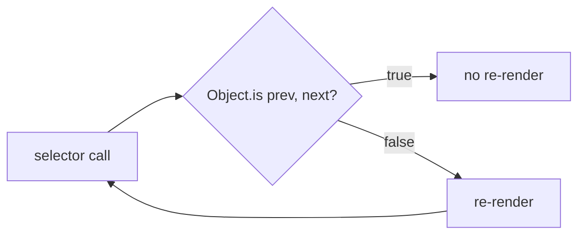

# <Library> — <Specific topic or feature>

> [!info] Why this note exists
> 문서를 찾아 읽게 만든 문제를 한 문장으로. 미래의 자신이 이 프레이밍에
> 감사하게 된다.

## Summary

30초 훑어보기를 위한 세 불릿 요약.

- **무엇인가** — 개념을 정의하는 한 문장.
- **언제 쓰는가** — 구체적인 트리거 / 문제 형태.
- **언제 쓰지 않는가** — 흔한 오용이나 더 적합한 인접 도구.

## Core API / pattern

최소한이지만 실행 가능한 예제. 설명 없는 플레이스홀더는 두지 말 것.

```<language>
// 주석이 달린 예제. 주석은 *왜*를 설명한다 *무엇*이 아니라 —
// 코드는 이미 무엇을 보여준다.
```

## Gotchas

번호 매긴 목록. 각 함정은 (a) 트랩, (b) 어떻게 당했는지, (c) 어떻게
피하는지로 구성된 단락이다.

1. **<Trap name>** — <paragraph>.
2. **<Another>** — <paragraph>.

## Comparison with alternatives

이 도구와 원래 손이 갔을 다른 도구를 짧게 표나 불릿으로 비교한다.
의미 있는 대안이 없으면 생략.

| Aspect | This | Alternative |
|--------|------|-------------|
| Ergonomics | ... | ... |
| Performance | ... | ... |
| Ecosystem | ... | ... |

## Visualization (optional)

다이어그램이 산문보다 더 명확할 때 추가한다 — 상태 머신, 데이터플로우,
타임라인. 순수 텍스트 개념에는 생략.



다이어그램 유형 선택 (sequence / state / ER / gantt / timeline /
mindmap / quadrant / MathJax / Excalidraw / JSON Canvas):
[../references/diagrams.md](../references/diagrams.md).

## How it connects to this project

- 사용 위치: `<file path>` 또는 [[<component note>]]
- 선택 이유: [[ADR-NNNN …]] 가 있다면
- 미해결 질문: 아직 필요하지 않았지만 그럴 수도 있는 것들

## Further reading

- [Official docs](<url>)
- [Key blog post or talk](<url>)
- [Source file we referenced](<url>)
