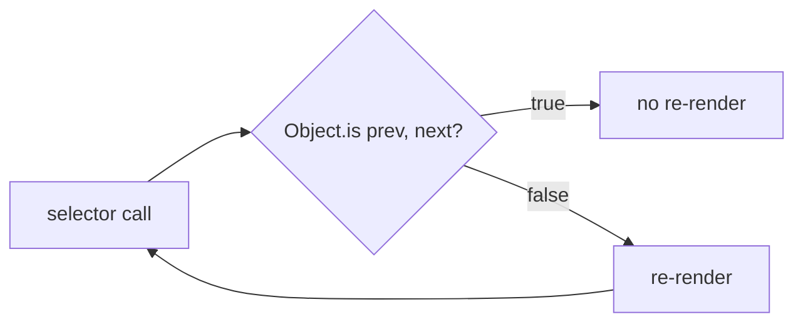

# <Library> — <Specific topic or feature>

> [!info] Why this note exists
> One sentence on the problem that sent you to the docs. Future-you will
> thank present-you for this framing.

## Summary

Three-bullet distillation for the 30-second skim:

- **What it is** — one sentence defining the concept.
- **When to use it** — concrete triggers / problem shapes.
- **When not to** — common misuses or adjacent tools that fit better.

## Core API / pattern

Minimal, runnable example. No placeholders unless you explain them.

```<language>
// Annotated example. Comments explain *why*, not *what* —
// the code already shows what.
```

## Gotchas

Numbered list. Each gotcha is a paragraph with (a) the trap, (b) how it
bit you, (c) how to avoid it.

1. **<Trap name>** — <paragraph>.
2. **<Another>** — <paragraph>.

## Comparison with alternatives

Short table or bulleted comparison of this tool vs. the one you might
have otherwise reached for. Skip if there's no meaningful alternative.

| Aspect | This | Alternative |
|--------|------|-------------|
| Ergonomics | ... | ... |
| Performance | ... | ... |
| Ecosystem | ... | ... |

## Visualization (optional)

Add a diagram when it clarifies more than prose — a state machine,
dataflow, or timeline. Skip for pure-text concepts.



Diagram-type selector (sequence / state / ER / gantt / timeline /
mindmap / quadrant / MathJax / Excalidraw / JSON Canvas):
[../references/diagrams.md](../references/diagrams.md).

## How it connects to this project

- Where we use it: `<file path>` or [[<component note>]]
- Why we picked it: [[ADR-NNNN …]] if there's one
- Open questions: things we haven't needed yet but might

## Further reading

- [Official docs](<url>)
- [Key blog post or talk](<url>)
- [Source file we referenced](<url>)
