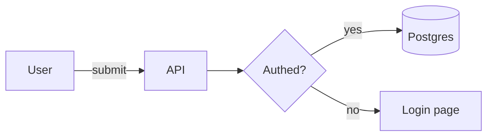
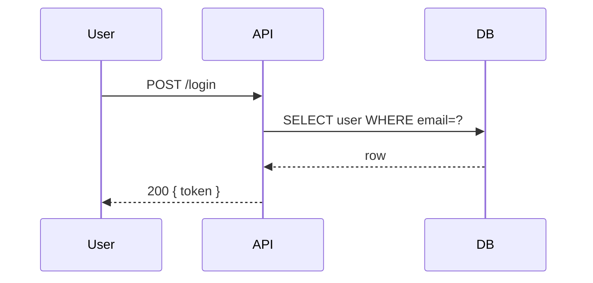
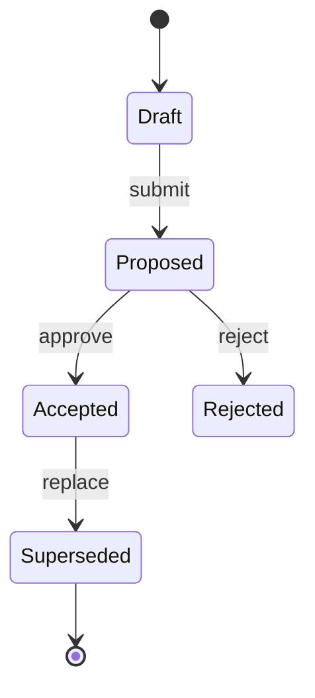
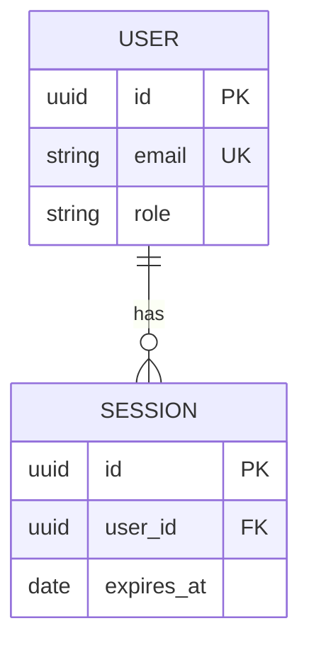
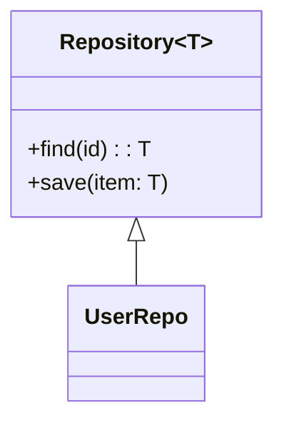
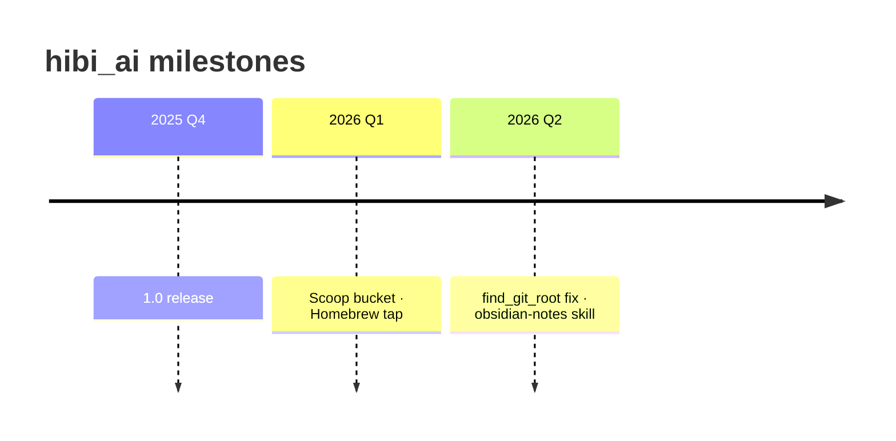
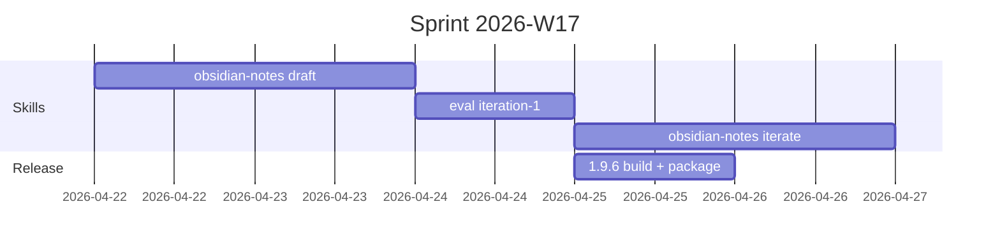
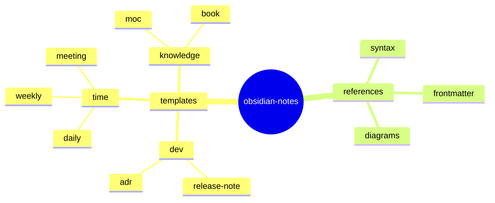
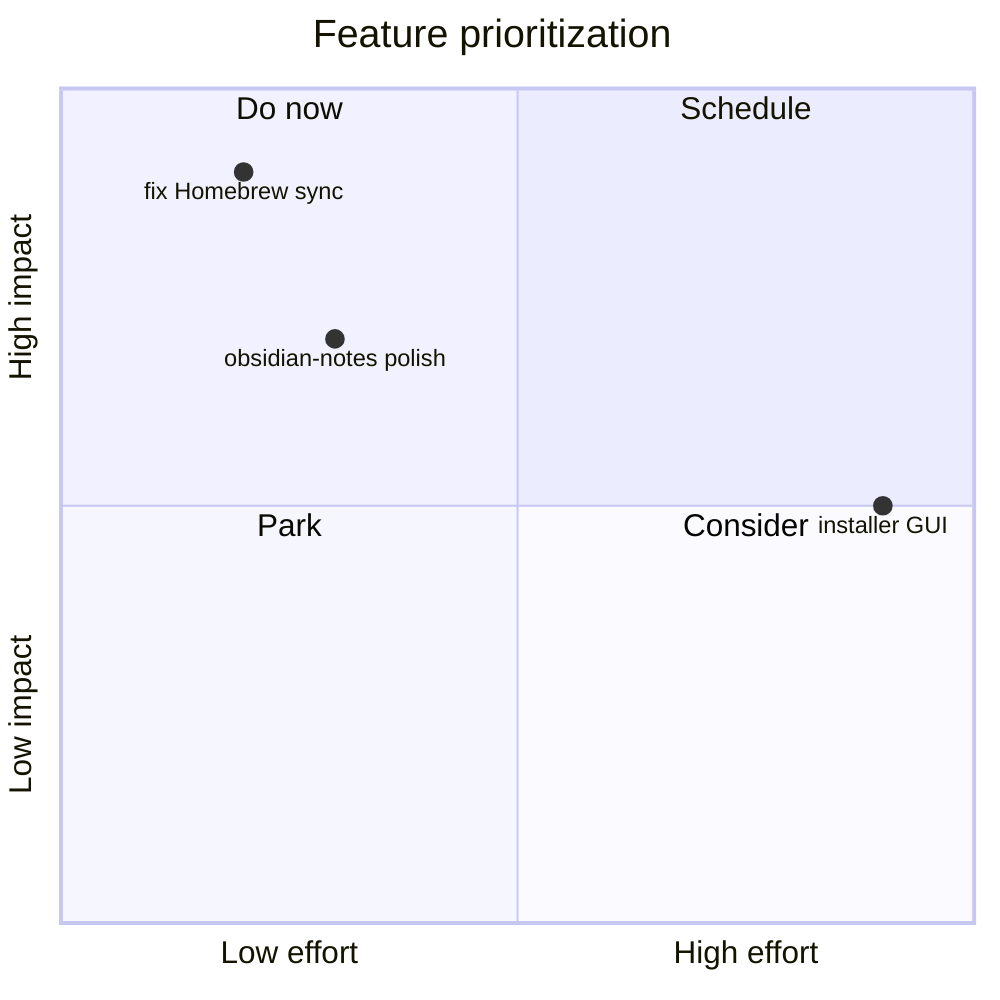
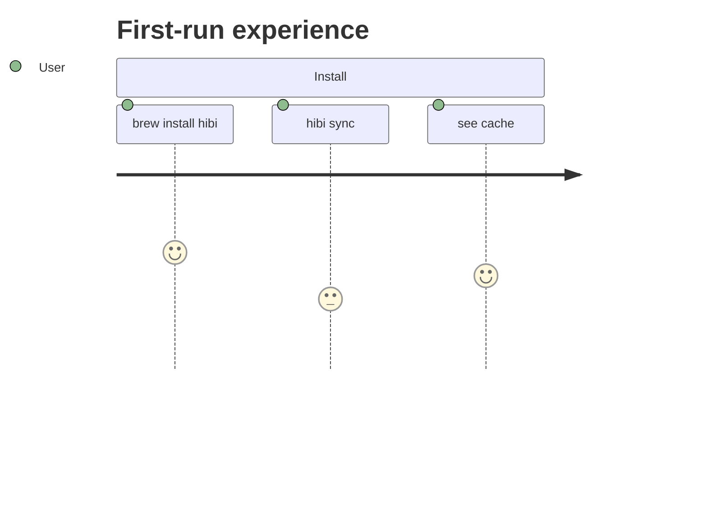

# Diagrams in Obsidian Notes

Obsidian은 Mermaid를 네이티브로 렌더링하고 (플러그인 불필요) Excalidraw와 JSON Canvas를 vault의 형제 파일로 통합한다. 설명하는 모양에 맞는 도구를 고른다 — 흐름과 계층에는 인라인 텍스트 다이어그램, 공간 레이아웃에는 별도 캔버스 파일.

## Decision tree

| Shape of the thought | Reach for |
|----------------------|-----------|
| 단계 시퀀스, state machine, 시스템 boxes-and-arrows | **Mermaid** inline |
| Timeline / 마일스톤 | **Mermaid** `timeline` 또는 `gantt` |
| 수학, 방정식 | **MathJax** (`$...$` / `$$...$$`) |
| 손으로 그린 느낌, 임의의 2D 레이아웃, 스티키 노트 브레인스토밍 | **Excalidraw** 파일, `![[file.excalidraw]]`로 임베드 |
| 다른 노드 종류를 가진 node-and-link 그래프 | **JSON Canvas** (`.canvas` 파일) |
| Free-form 공간 MOC (평면에 배치된 노트) | **JSON Canvas** |
| Mermaid보다 강한 사양의 UML (class/component) | **PlantUML** (커뮤니티 플러그인 필요) |

Rule of thumb: **텍스트 기반 다이어그램은 노트 안에 산다**; **공간/시각적인 것은 형제 파일로 살고** 임베드된다.

## Mermaid — recipe selector

Mermaid는 많은 다이어그램 타입을 지원한다. 정보를 전달하는 가장 간단한 것을 사용한다; 리스트로 충분할 때 `graph TB`에 손을 대지 않는다.

### Flowchart — processes, system diagrams, call flows

````markdown

````

- 방향에 `LR` / `TB` / `RL` / `BT`.
- `[]` box, `(())` circle, `{}` diamond (decision), `[()]` database.
- Edge label은 `-- text -->` 또는 `|text|`로.

### Sequence — interactions between participants

````markdown

````

순서와 누가 누구와 이야기하는지가 중요할 때 사용한다.
`->>` sync, `-->>` async/response, `-x` lost message.

### State diagram — lifecycle, status transitions

````markdown

````

ADR status, 버그 lifecycle, 기능 플래그 롤아웃에 완벽하다.

### ER diagram — data model

````markdown

````

데이터 모델 소개를 위한 학습 노트에 사용; 스키마 변경이 결정인 ADR에서.

### Class diagram — type/trait relations

````markdown

````

### Timeline — non-quantitative time

````markdown

````

"무엇이 언제 일어났는지" narrative에 `timeline`을 선호한다. bar가 duration 정보를 담을 때 `gantt`을 사용한다.

### Gantt — schedules, sprints

````markdown

````

### Mindmap — brainstorm hierarchy

````markdown

````

fleeting note에 적합하다. link가 중요할 때 MOC의 대체물이 아니다.

### Quadrant chart — tradeoffs, prioritization

````markdown

````

### Journey — user flow with sentiment

````markdown

````

## MathJax — equations

Obsidian은 인라인 (`$...$`)과 블록 (`$$...$$`) MathJax를 렌더링한다.

```markdown
Inline: $e^{i\pi} + 1 = 0$

Block:
$$
\lim_{n \to \infty} \left(1 + \frac{1}{n}\right)^n = e
$$
```

수학이 콘텐츠 자체일 때 학습 노트에서 사용한다. 단순 부등식에는 피하라 — 대부분의 prose에서 `$O(n \log n)$`보다 backtick의 `O(n log n)`이 더 명확하다.

## PlantUML

Obsidian은 PlantUML을 네이티브로 렌더링하지 않는다; **PlantUML** 커뮤니티 플러그인이 필요하다. 문법은 fenced `plantuml` 블록에 산다. 다이어그램이 맞으면 Mermaid를 선호한다 — 추가 플러그인 없이 렌더링하므로 어떤 vault에서도 노트가 작동한다. Mermaid가 표현할 수 없는 다이어그램 (상세 제어 흐름의 activity diagram, deployment diagram, 특정 UML 변형)에만 PlantUML로 떨어진다.

## Excalidraw integration

손으로 그린, 공간적, 협업적 다이어그램의 경우:

1. 커뮤니티 **Excalidraw** 플러그인을 설치한다.
2. New file → "Create new Excalidraw drawing" → `.excalidraw.md` 파일이 일반 노트와 함께 생성된다.
3. `![[My Drawing.excalidraw]]`로 어떤 노트에서든 임베드한다.

사용 사례: ADR의 아키텍처 스케치, fleeting note의 화이트보드 스타일 브레인스토밍, Mermaid에 너무 지저분한 손으로 그린 flowchart.

단점: 그림은 JSON 파일이다 — git에서 diff가 좋지 않다. pull request에서 리뷰하고 싶은 어떤 것이든 Mermaid를 선호한다.

## JSON Canvas (`.canvas`)

Obsidian의 빌트인 공간 레이아웃 형식. 리본이나 `New canvas`로 생성한다. Canvas 파일은 노트 옆에 살고 **기존 노트를 카드로 임베드**할 수 있으며, freeform 텍스트/파일 노드도.

가장 좋은 용도:

- **공간 MOC** — `[[note cards]]`을 zone에 배치 ("doing", "done", "blocked")
- **각 노드가 링크된 노트인 시스템 다이어그램** — 박스 뒤의 ADR로 클릭 통과
- **워크숍 보드** — sprint planning, retro Start/Stop/Continue

`![[Project Board.canvas]]`로 노트에 캔버스를 임베드한다 (최근 Obsidian 버전은 인라인으로 미리보기를 렌더링한다).

Canvas MOC가 노트 기반 MOC를 능가하는 경우는 [vault-organization.md](vault-organization.md) 참조.

## Anti-patterns

- **학습 노트의 거대한 flowchart** — 다이어그램이 50줄 이상 걸리면, 자체 `.excalidraw`나 `.canvas` 파일로 만들고 임베드한다.
- **테이블에 Mermaid** — 진짜 Markdown 테이블을 사용한다.
- **ASCII art** — Obsidian은 fenced 코드 블록의 공백을 보존하지만, Mermaid / Canvas가 더 유지보수 가능하다. ASCII는 짧은 디렉토리 트리나 파이프라인 막대 차트로 예약한다.
- **플러그인 없는 PlantUML** — fallback HTML이 렌더링되지 않는다; viewer가 raw text를 본다. 사용 전 대상 vault에 플러그인이 있는지 확인한다.
