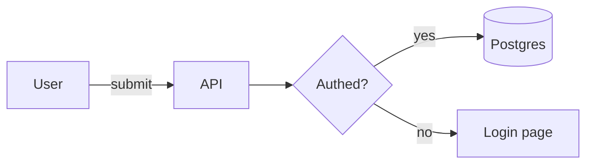
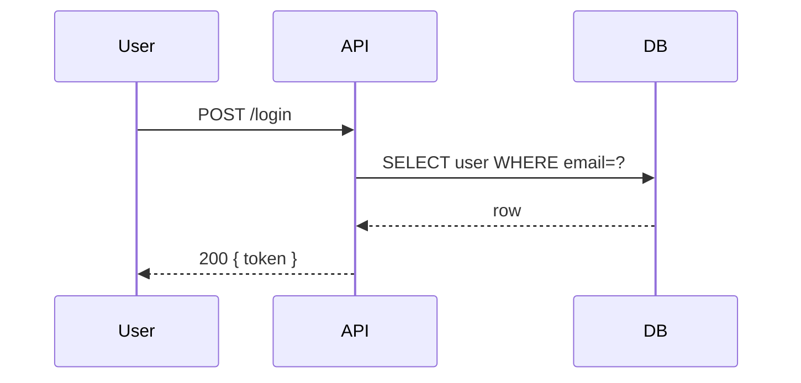
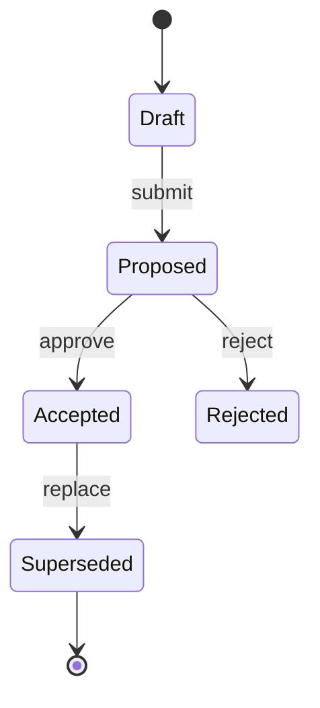
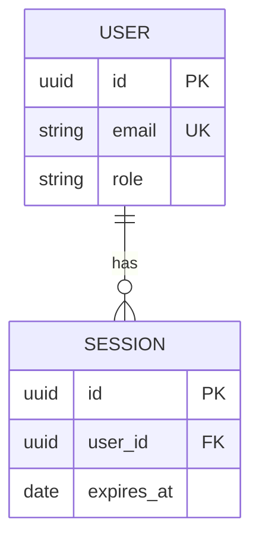
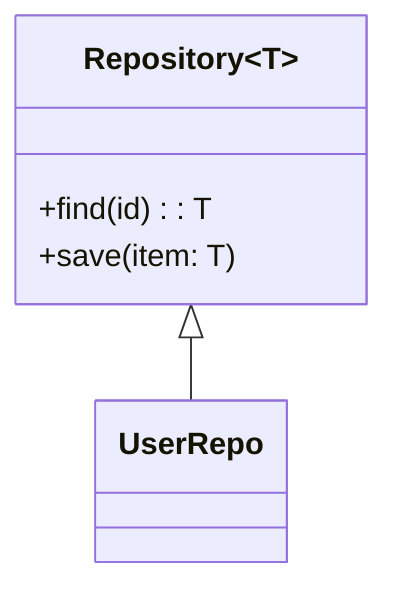
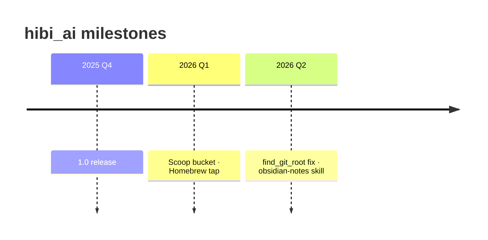
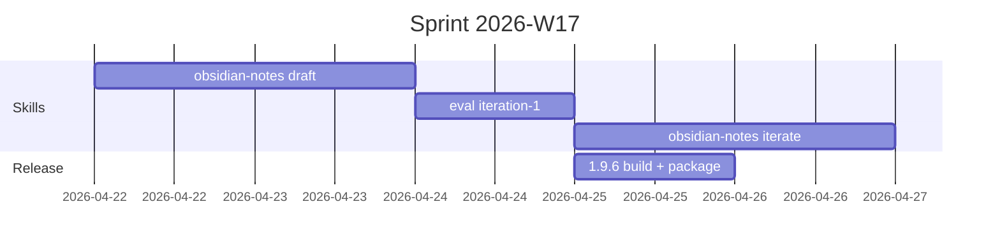
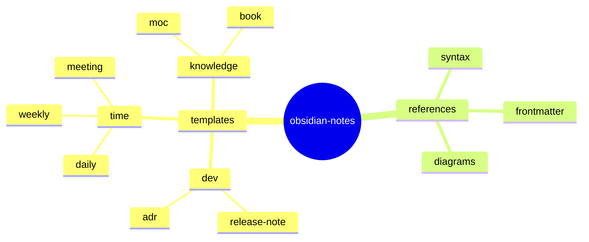
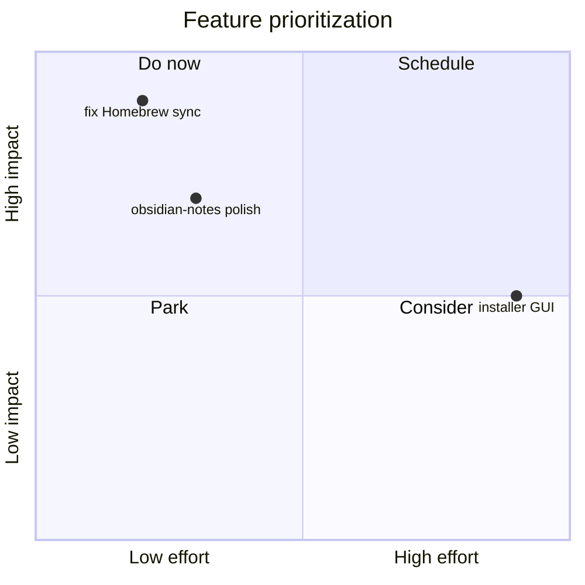
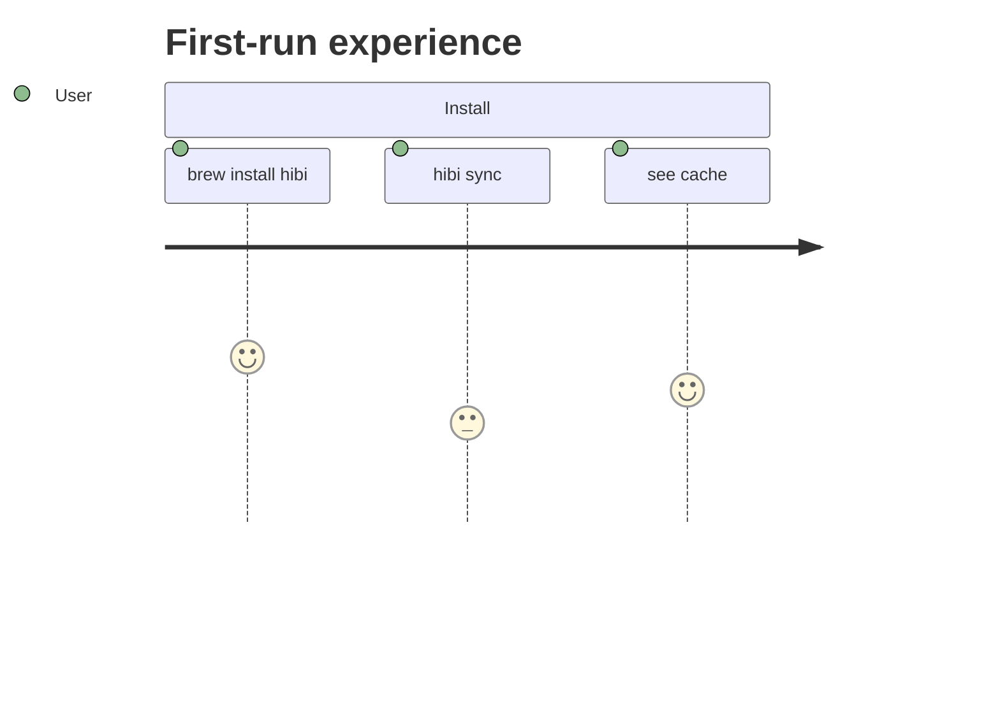

# Diagrams in Obsidian Notes

Obsidian renders Mermaid natively (no plugin needed) and integrates with
Excalidraw and JSON Canvas as sibling files in the vault. Pick the right
tool for the shape you're describing — inline text diagrams for flows
and hierarchies, separate canvas files for spatial layouts.

## Decision tree

| Shape of the thought | Reach for |
|----------------------|-----------|
| Sequence of steps, state machine, system boxes-and-arrows | **Mermaid** inline |
| Timeline / milestones | **Mermaid** `timeline` or `gantt` |
| Math, equations | **MathJax** (`$...$` / `$$...$$`) |
| Hand-drawn feel, arbitrary 2D layout, sticky-note brainstorm | **Excalidraw** file, embed as `![[file.excalidraw]]` |
| Node-and-link graph with different node kinds | **JSON Canvas** (`.canvas` file) |
| Free-form spatial MOC (notes arranged on a plane) | **JSON Canvas** |
| UML with stronger spec (class/component) than Mermaid | **PlantUML** (requires community plugin) |

Rule of thumb: **text-based diagrams live inside the note**;
**spatial/visual ones live as a sibling file** and are embedded.

## Mermaid — recipe selector

Mermaid supports many diagram types. Use the simplest that conveys the
information; don't reach for `graph TB` when a list would do.

### Flowchart — processes, system diagrams, call flows

````markdown

````

- `LR` / `TB` / `RL` / `BT` for direction.
- `[]` box, `(())` circle, `{}` diamond (decision), `[()]` database.
- Edge labels with `-- text -->` or `|text|`.

### Sequence — interactions between participants

````markdown

````

Use when you care about ordering and who talks to whom.
`->>` sync, `-->>` async/response, `-x` lost message.

### State diagram — lifecycle, status transitions

````markdown

````

Perfect for ADR status, bug lifecycle, feature flag rollout.

### ER diagram — data model

````markdown

````

Use in learning notes for data-model introductions; in ADRs when a
schema change is the decision.

### Class diagram — type/trait relations

````markdown

````

### Timeline — non-quantitative time

````markdown

````

Prefer `timeline` for "what happened when" narratives. Use `gantt` when
the bars carry duration information.

### Gantt — schedules, sprints

````markdown

````

### Mindmap — brainstorm hierarchy

````markdown

````

Fine for fleeting notes. Not a substitute for a MOC when the links
matter.

### Quadrant chart — tradeoffs, prioritization

````markdown

````

### Journey — user flow with sentiment

````markdown

````

## MathJax — equations

Obsidian renders MathJax inline (`$...$`) and block (`$$...$$`).

```markdown
Inline: $e^{i\pi} + 1 = 0$

Block:
$$
\lim_{n \to \infty} \left(1 + \frac{1}{n}\right)^n = e
$$
```

Use in learning notes when the math IS the content. Avoid for simple
inequalities — `O(n log n)` in backticks is clearer than `$O(n \log n)$`
for most prose.

## PlantUML

Obsidian does not render PlantUML natively; the **PlantUML** community
plugin is required. Syntax lives in a fenced `plantuml` block. Prefer
Mermaid when the diagram fits — it renders without extra plugins, so
your note works on any vault. Fall back to PlantUML only for diagrams
Mermaid can't express (activity diagrams with detailed control flow,
deployment diagrams, certain UML variants).

## Excalidraw integration

For hand-drawn, spatial, or collaborative diagrams:

1. Install the community **Excalidraw** plugin.
2. New file → "Create new Excalidraw drawing" → a `.excalidraw.md`
   file is created alongside regular notes.
3. Embed in any note with `![[My Drawing.excalidraw]]`.

Use cases: architecture sketches in ADRs, whiteboard-style
brainstorms in fleeting notes, hand-drawn flowcharts too messy for
Mermaid.

Downside: the drawing is a JSON file — diffs aren't great in git.
Prefer Mermaid for anything you want to review in pull requests.

## JSON Canvas (`.canvas`)

Obsidian's built-in spatial-layout format. Create with the ribbon or
`New canvas`. Canvas files live alongside notes and can **embed
existing notes as cards**, plus freeform text/file nodes.

Best for:

- **Spatial MOCs** — lay out `[[note cards]]` in zones ("doing",
  "done", "blocked")
- **System diagrams where each node IS a linked note** — click
  through to the ADR behind a box
- **Workshop boards** — sprint planning, retro Start/Stop/Continue

Embed a canvas in a note with `![[Project Board.canvas]]` (recent
Obsidian versions render the preview inline).

See [vault-organization.md](vault-organization.md) for when a Canvas
MOC beats a note-based MOC.

## Anti-patterns

- **Huge flowchart in a learning note** — if the diagram takes 50+
  lines, make it its own `.excalidraw` or `.canvas` file and embed.
- **Mermaid for tables** — use a real Markdown table.
- **ASCII art** — Obsidian preserves whitespace in fenced code blocks,
  but Mermaid / Canvas are more maintainable. Reserve ASCII for short
  directory trees or pipeline bar charts.
- **PlantUML without the plugin** — fallback HTML won't render; viewer
  sees raw text. Check the target vault has the plugin before using.
