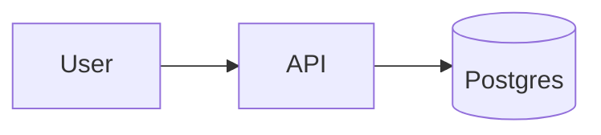

# Obsidian Flavored Markdown Cheatsheet

이 skill이 의존하는 OFM 기능에 대한 압축된 레퍼런스. 전체 문서: <https://help.obsidian.md>.

## Wikilinks

```markdown
[[Note Title]]                  basic link to a vault note
[[Note Title|display]]          link with custom display text
[[Note#Heading]]                deep link to a heading inside the note
[[Note#^block-id]]              block reference (stable across edits)
![[Note Title]]                 transclude (embed) the note inline
![[Note Title#Section]]         transclude just a section
![[image.png|300]]              embed image with width hint
```

Wikilink는 vault 상대적이다 — Obsidian은 linker의 폴더와 관계없이 해석한다. 어떤 내부 참조에든 이를 선호한다.

## Callouts

Callout은 type hint가 있는 blockquote이다. `collapsed`가 추가되면 기본적으로 접힌다.

```markdown
> [!info] Context
> Optional title after the type. Body supports any Markdown.

> [!warning]
> Default title inferred from type ("Warning") when omitted.

> [!note]+ Expanded
> `+` means start expanded.

> [!tip]- Collapsed tip
> `-` means start collapsed.
```

지원되는 타입 (괄호의 alias): `note`, `abstract` (`summary`, `tldr`), `info`, `todo`, `tip` (`hint`, `important`), `success` (`check`, `done`), `question` (`help`, `faq`), `warning` (`caution`, `attention`), `failure` (`fail`, `missing`), `danger` (`error`), `bug`, `example`, `quote` (`cite`).

의미적으로 사용한다:
- **Context section** → `> [!info]`
- **Risks / breaking** → `> [!warning]` 또는 `> [!danger]`
- **Open questions** → `> [!question]`
- **Decision outcome** → `> [!success]`
- **Known issue** → `> [!bug]`

## Headings

`# H1`을 정확히 한 번 사용한다 (제목). H2 섹션이 본문 범위를 정한다. Dataview와 outline panel은 heading 계층에 의존한다.

## Tags

```markdown
#type/adr
#project/hibi-ai
#topic/perf
```

`/`로 중첩된다 — `#type/adr`과 `#type/release`는 `#type` 아래의 형제이다. frontmatter (메타데이터에 선호)와 본문의 태그는 Obsidian이 병합한다. 중복하지 마라.

## Properties (frontmatter)

파일 상단의 YAML 블록:

```yaml
---
type: adr
status: accepted
tags: [type/adr, project/hibi-ai]
related: ["[[Other Note]]"]
created: 2026-04-21
---
```

다중 값 field에 대괄호로 배열을 사용한다. Obsidian은 이를 타입화된 properties로 파싱한다 — dataview와 property panel 둘 다 이를 읽는다.

## Block references

다른 노트가 형제 콘텐츠가 이동하더라도 link할 수 있도록 단락에 안정적인 id를 준다:

```markdown
The sync path calls `find_git_root` before cloning. ^sync-order
```

그런 다음 다른 곳에서: `[[Other Note#^sync-order]]`가 그 단락으로 해석된다. 릴리스 노트에서 참조되는 긴 ADR 컨텍스트 섹션에 유용하다.

## Task lists

```markdown
- [ ] open action item
- [x] completed
- [/] in progress (non-standard but rendered by some themes)
- [>] deferred
- [-] cancelled
```

Dataview는 vault 전반에 걸쳐 status로 task를 query할 수 있다 — 회고와 디버그 로그가 이로부터 이득을 본다.

## Tables

```markdown
| Col | Col |
|-----|-----|
| ... | ... |
```

테이블을 짧게 유지한다. ~10행 이상은 많은 작은 노트의 frontmatter field에 대한 dataview 쿼리를 선호한다.

## Footnotes

```markdown
Claim backed by source.[^1]

[^1]: Source text goes here.
```

흐름을 어지럽히지 않고 PR/issue를 인용하는 릴리스 노트에 유용하다.

## Embeds (`![[...]]`)

전체 노트나 섹션을 현재로 transclude한다. Live Preview와 Reading mode는 참조된 콘텐츠를 인라인으로 렌더링한다. 유용한 경우:

- 릴리스 노트로 ADR의 "Consequences" 섹션 가져오기
- 회고 안에 디버그 로그 요약 표시

```markdown
![[ADR-0012 Scope find_git_root#Consequences]]
```

## Dataview (essentials)

Dataview는 커뮤니티 플러그인이지만 대부분의 vault에 있다. frontmatter + tag를 query 가능한 데이터로 바꾼다.

```dataview
TABLE status, created
FROM "Release Notes"
WHERE type = "release"
SORT created DESC
LIMIT 10
```

```dataview
LIST
FROM #type/adr
WHERE status = "accepted"
SORT file.name ASC
```

모든 template에서 dataview 쿼리를 인라인하지 마라 — aggregation하는 인덱스 노트 (MOC / 폴더 노트)에 예약한다.

## Mermaid diagrams

Obsidian은 `mermaid`로 태그된 fenced 블록에서 Mermaid를 네이티브로 렌더링한다. 플러그인 불필요. flowchart, sequence, state machine, ER diagram, timeline, gantt chart, mindmap, quadrant chart에 사용한다.

````markdown

````

전체 다이어그램 카탈로그와 "어떤 모양에 어떤 다이어그램" 가이드는 [diagrams.md](diagrams.md)에 있다. 모양이 맞으면 PlantUML보다 Mermaid를 선호한다 — PlantUML은 커뮤니티 플러그인이 필요하다.

## Math (MathJax)

인라인 수학: `$e^{i\pi} + 1 = 0$`.
블록 수학:

```markdown
$$
\sum_{i=0}^{n} i = \frac{n(n+1)}{2}
$$
```

수학이 콘텐츠 *자체*일 때만 사용한다. prose의 복잡도는 강제 LaTeX보다 backtick `` `O(n log n)` ``이 더 잘 읽힌다.

## What NOT to use

- 레이아웃에 **HTML `<br>`/`<div>`** — 오래된 Obsidian 버전에서 Reading 모드 렌더링을 깨고 그래프 파싱을 해친다.
- **base64로 인라인 이미지** — vault 상대 `![[image.png]]`을 사용한다.
- **wikilink의 절대 경로** — 중복이며 폴더가 이동하면 깨진다.
- **frontmatter의 `- [ ]` 태스크** — 태스크는 본문에만 산다.
- **플러그인 설치 없는 PlantUML** — raw text로 렌더링; 다이어그램이 진짜 PlantUML 기능이 필요하지 않으면 Mermaid를 선호한다.
