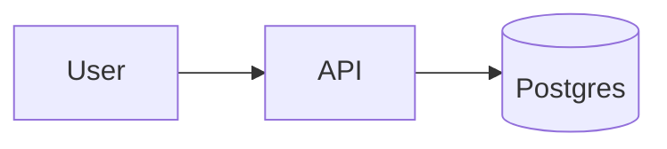

# Obsidian Flavored Markdown Cheatsheet

A condensed reference for the OFM features this skill leans on. Full
docs: <https://help.obsidian.md>.

## Wikilinks

```markdown
[[Note Title]]                  basic link to a vault note
[[Note Title|display]]          link with custom display text
[[Note#Heading]]                deep link to a heading inside the note
[[Note#^block-id]]              block reference (stable across edits)
![[Note Title]]                 transclude (embed) the note inline
![[Note Title#Section]]         transclude just a section
![[image.png|300]]              embed image with width hint
```

Wikilinks are vault-relative — Obsidian resolves them regardless of the
linker's folder. Prefer them for any internal reference.

## Callouts

Callouts are blockquotes with a type hint. Folded by default when
`collapsed` is added.

```markdown
> [!info] Context
> Optional title after the type. Body supports any Markdown.

> [!warning]
> Default title inferred from type ("Warning") when omitted.

> [!note]+ Expanded
> `+` means start expanded.

> [!tip]- Collapsed tip
> `-` means start collapsed.
```

Supported types (aliases in parens): `note`, `abstract` (`summary`,
`tldr`), `info`, `todo`, `tip` (`hint`, `important`), `success` (`check`,
`done`), `question` (`help`, `faq`), `warning` (`caution`, `attention`),
`failure` (`fail`, `missing`), `danger` (`error`), `bug`, `example`,
`quote` (`cite`).

Use them semantically:
- **Context section** → `> [!info]`
- **Risks / breaking** → `> [!warning]` or `> [!danger]`
- **Open questions** → `> [!question]`
- **Decision outcome** → `> [!success]`
- **Known issue** → `> [!bug]`

## Headings

Use `# H1` exactly once (the title). H2 sections scope the body. Dataview
and the outline panel rely on heading hierarchy.

## Tags

```markdown
#type/adr
#project/hibi-ai
#topic/perf
```

Nested with `/` — `#type/adr` and `#type/release` are siblings under
`#type`. Tags in frontmatter (preferred for metadata) and in body are
merged by Obsidian. Don't duplicate.

## Properties (frontmatter)

YAML block at the top of the file:

```yaml
---
type: adr
status: accepted
tags: [type/adr, project/hibi-ai]
related: ["[[Other Note]]"]
created: 2026-04-21
---
```

Use arrays with square brackets for multi-value fields. Obsidian parses
these into typed properties — dataview and the property panel both read
them.

## Block references

Give a paragraph a stable id so other notes can link to it even if
sibling content moves:

```markdown
The sync path calls `find_git_root` before cloning. ^sync-order
```

Then elsewhere: `[[Other Note#^sync-order]]` resolves to that paragraph.
Useful for long ADR context sections referenced from release notes.

## Task lists

```markdown
- [ ] open action item
- [x] completed
- [/] in progress (non-standard but rendered by some themes)
- [>] deferred
- [-] cancelled
```

Dataview can query tasks by status across the vault — retrospectives and
debug logs benefit from this.

## Tables

```markdown
| Col | Col |
|-----|-----|
| ... | ... |
```

Keep tables short. For anything over ~10 rows, prefer a dataview query
on frontmatter fields across many small notes.

## Footnotes

```markdown
Claim backed by source.[^1]

[^1]: Source text goes here.
```

Useful for release notes citing PRs/issues without cluttering the flow.

## Embeds (`![[...]]`)

Transclude a whole note or section into the current one. The Live Preview
and Reading modes render the referenced content inline. Useful for:

- Pulling an ADR's "Consequences" section into a release note
- Showing a debug log summary inside a retrospective

```markdown
![[ADR-0012 Scope find_git_root#Consequences]]
```

## Dataview (essentials)

Dataview is a community plugin, but most vaults have it. It turns
frontmatter + tags into queryable data.

```dataview
TABLE status, created
FROM "Release Notes"
WHERE type = "release"
SORT created DESC
LIMIT 10
```

```dataview
LIST
FROM #type/adr
WHERE status = "accepted"
SORT file.name ASC
```

Don't inline dataview queries in every template — reserve them for index
notes (MOC / folder notes) that aggregate.

## Mermaid diagrams

Obsidian renders Mermaid natively in fenced blocks tagged `mermaid`.
No plugin required. Use for flowcharts, sequences, state machines, ER
diagrams, timelines, gantt charts, mindmaps, and quadrant charts.

````markdown

````

Full diagram catalog and "which diagram for which shape" guide lives
in [diagrams.md](diagrams.md). Prefer Mermaid over PlantUML when the
shape fits — PlantUML needs a community plugin.

## Math (MathJax)

Inline math: `$e^{i\pi} + 1 = 0$`.
Block math:

```markdown
$$
\sum_{i=0}^{n} i = \frac{n(n+1)}{2}
$$
```

Use only when the math *is* the content. For complexity in prose,
backticks like `` `O(n log n)` `` read better than forced LaTeX.

## What NOT to use

- **HTML `<br>`/`<div>`** for layout — breaks Reading-mode rendering in
  older Obsidian versions and hurts graph parsing.
- **Inline images as base64** — use vault-relative `![[image.png]]`.
- **Absolute paths in wikilinks** — redundant and breaks if folders move.
- **`- [ ]` tasks in frontmatter** — tasks live in the body only.
- **PlantUML without the plugin installed** — renders as raw text;
  prefer Mermaid unless the diagram genuinely needs PlantUML features.
